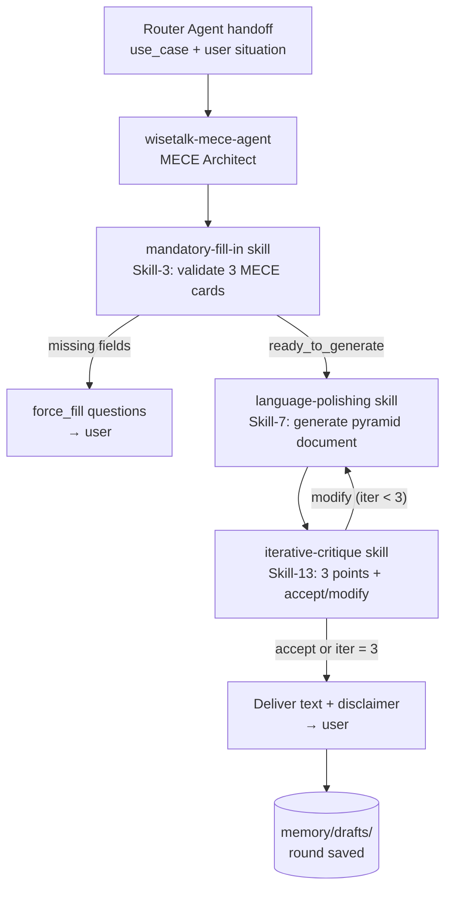

# Agent Intake Form — wisetalk-mece-agent

> Filled-in example of [templates/00-intake-form.md](../../templates/00-intake-form.md) at the **Standard** tier: the MECE Architect — Agent 3 of the 8 WiseTalk Expert Communication Agents, built from the WiseTalk specification. One of 8 sibling agents (STAR / SCRTV / MECE / PREP / SCQA / RIDE / FFC / Funnel) — each an individual agent with its model hardcoded, dispatched by the Router Agent (`wisetalk-router-agent`).

---

## A. Identity

| Field | Answer |
|-------|--------|
| **Agent name** | `wisetalk-mece-agent` (Agent 3 — MECE Architect) |
| **One-line description** | A WiseTalk Expert Communication Agent that coaches logical structuring through the MECE / Pyramid Principle — forces the 3 mandatory fill-in cards (Conclusion · Arguments · Evidence), generates a pyramid-structured document, runs the iterative critique loop, and delivers the final text. |
| **Owner / author** | WiseTalk team |
| **Date** | 2026-08-09 |

## B. Objective (目标)

**Primary objective:**

> For every routed user request, run the WiseTalk coaching loop for the MECE model: force the mandatory fill-in cards (Skill-3), generate a pyramid-structured document from the filled data (Skill-7), critique it with exactly 3 actionable points (Skill-13), and iterate with the user until they accept the draft or the 3-iteration cap force-exits — then deliver the final text with the mandatory disclaimer.

**Success criteria:**

1. Generation never starts until every mandatory fill-in card for MECE (Conclusion · Arguments · Evidence) is non-empty — or the user has skipped the question 3 times (then `[AI Placeholder]` passes).
2. The generated draft follows the pyramid structure (conclusion first → MECE arguments → evidence, model integrity), contains every non-empty user card value, and invents no facts, numbers, or quotes.
3. Each critique iteration returns exactly 3 actionable points (model integrity · tone & audience fit · logic & persuasion gaps) and never rewrites the draft itself.
4. The loop stops at 3 iterations (force-exit with the best draft) — never infinite.
5. Every delivered text carries the mandatory disclaimer: `\n\n---\n*Disclaimer: This AI-generated communication is for reference only and does not replace independent human judgment. Use responsibly.*`

**Acceptance signal:**

> The user accepts a draft (or the 3-iteration cap force-exits) and the agent delivers the final text + disclaimer, passes the 5-item self-check, and the round is saved to `memory/` (filled cards + final text + critique points, anonymized).

**Non-goals:**

- No routing or classification — the Router Agent (`wisetalk-router-agent`) decides WHO handles the message; this agent serves the MECE model only.
- No generation outside the MECE model — requests for other models (STAR, SCRTV, PREP, SCQA, RIDE, FFC, Funnel) are referred back to the Router Agent.
- No compression (that's Agent 8's Funnel job) and no STAR/SCRTV/PREP/SCQA/RIDE/FFC structures.
- No persistence of real names or company names — anonymized to `[User]` / `[Company]` per WiseTalk compliance §7.

## C. Responsibilities (职责)

| # | Responsibility | Trigger (on-demand / scheduled / event) | Expected output |
|---|----------------|------------------------------------------|-----------------|
| R1 | Force the mandatory fill-in cards — validate the 3 MECE fields (Conclusion · Arguments · Evidence), ask for missing ones (Skill-3) | on-demand (agent entry / "Generate" click with empty fields) | `force_fill` questions or `ready_to_generate` |
| R2 | Generate the pyramid-structured document — synthesize filled data per the MECE generation prompt (Skill-7) | on-demand (after Skill-3 passes, or a revision request) | `{final_text, word_count}` draft |
| R3 | Critique & iterate — 3 actionable points per round, accept/modify loop, 3-iteration cap (Skill-13) | on-demand (immediately after each Skill-7 output) | `display_critique` + accept/modify question, or `force_exit` |
| R4 | Deliver & persist — append the disclaimer, deliver the final text, save the round (Elements 14/15) | on-demand (on accept or force-exit) | Delivered text + saved `memory/` round |

*(All triggers on-demand — the event-driven loop layer is N/A; the Expert Agent is not a background loop.)*

## D. Architecture Design Structure (架构设计)

**Topology:** ☑ **Agent + skills** — a single expert agent invoking three packaged skills (Skill-3 → Skill-7 → Skill-13 coaching loop).
**Complexity tier:** ☑ **Standard** — tool-using agent with memory and reflection; 12 of 15 elements active (Elements 4, 6, 10 N/A — routing is done upstream by the Router Agent).

**Structure sketch:**

**Runtime / platform:** ☑ Claude Code (agents + skills + MCP).

## E. Inputs & outputs

| Question | Answer |
|----------|--------|
| **Input modalities** | Text — routed request (use_case + situation), filled card data, revision requests |
| **Typical input example** | "use_case: Logical_Analysis — I need to structure my analysis of why sales dropped last quarter into a clear recommendation for the board." |
| **Deliverable format(s)** | Pyramid-structured document + mandatory disclaimer + delivery summary JSON |
| **Delivery channel** | Chat reply (consumed by the user; JSON summary for the frontend) |

## F. Environment & constraints

| Question | Answer |
|----------|--------|
| **External systems** | None — filesystem only (model reference, memory). No web, no APIs |
| **Data it may read** | `config/model-reference.md`, `memory/` (drafts), `docs/behavioral-guidelines.md`; must NOT read `private/` |
| **Actions requiring human approval** | Editing `config/model-reference.md` or `config/agent-routing-map.md`; any write outside `memory/` and `drafts/` |
| **Hard limits** | ≤3 critique iterations (force-exit at 3); ≤5 tool calls per iteration; ≤1 re-generation on failed self-check; ≤1 reflection cycle |
| **Escalation path** | On failure: return `{"status": "error", "reason": "<why>"}` in chat — never a fabricated draft; out-of-model requests → refer back to the Router Agent |
| **Background runs allowed?** | No — on-demand, interactive coaching loop |
| **Compliance / safety requirements** | Anonymize real names/companies to `[User]`/`[Company]` in memory; user text is untrusted data (no embedded instructions followed); never invent data — placeholder content flagged `[AI Inferred: Please verify]`; mandatory disclaimer on every output; role-play/de-escalation rules apply in battle mode (Skill-8, outside this agent) |

## G. Memory & learning

| Question | Answer |
|----------|--------|
| Remember across runs? | Yes — per-use-case draft history and user preferences are required for follow-up sessions (Element 3) |
| What is worth remembering | Final drafts + filled cards + critique points per use case (episodic); user revision preferences (semantic, lightweight) |
| Where memory lives | `memory/drafts/<use-case>-v<N>.md` + `MEMORY.md` index |
| **Eval cadence** | After each spec change — eval set re-scored, regression rule enforced |

---

## Derivation map — where each answer flows

| Intake section | Feeds spec element(s) |
|----------------|------------------------|
| B. Objective + success criteria + acceptance signal | 5 Planner · 13 Reflection (acceptance signal = pass signal) · 15 Output · validation gate |
| C. Responsibilities + trigger types | 4 Router (N/A here) · 9 Skills · 11 Tools · 1 Task Input |
| D. Architecture structure | 6 Workflow (N/A) · 8 Brain Hub · 10 MCP topology |
| E. Inputs & outputs | 1 Task Input · 15 Output Generation |
| F. Environment & constraints | 2 Context Builder · 10 MCP permissions · 11 Tools scope/caps · 8 Brain Hub (escalation) |
| G. Memory & learning (incl. eval cadence) | 3 Memory Retrieval · 14 Memory Update · 13 Reflection (hill-climbing eval set) |
