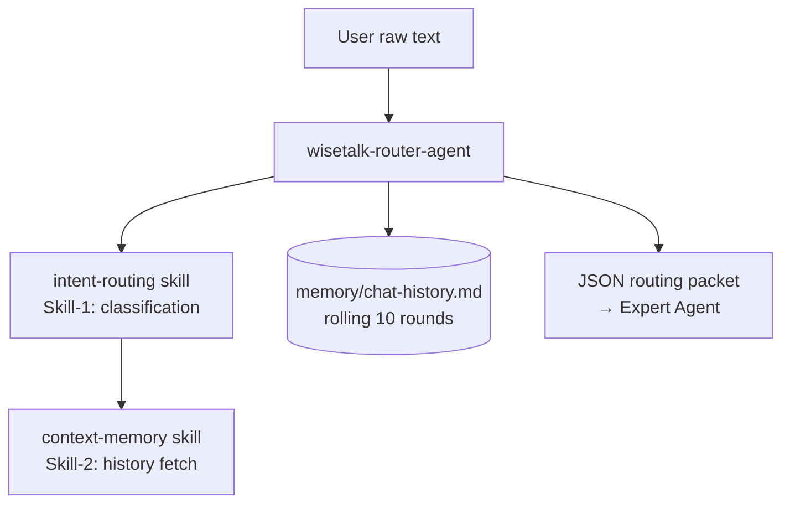

# Agent Intake Form — wisetalk-router-agent

> Filled-in example of [templates/00-intake-form.md](../../templates/00-intake-form.md) at the **Standard** tier: a single-agent gateway with two packaged skills (intent routing + context memory), built from the WiseTalk specification.

---

## A. Identity

| Field | Answer |
|-------|--------|
| **Agent name** | `wisetalk-router-agent` |
| **One-line description** | The WiseTalk entry gatekeeper — classifies workplace communication needs against 8 communication models and routes each user to the best-fit Expert Agent with conversation context. |
| **Owner / author** | WiseTalk team |
| **Date** | 2026-08-09 |

## B. Objective (目标)

**Primary objective:**

> For every raw user input about a workplace communication need, produce a routing decision — best-matching Expert Agent (1 of 8), use case (1 of 32), context label, and confidence score — plus the conversation context the Expert Agent needs, obeying the WiseTalk fallback rules.

**Success criteria:**

1. Every input is classified to exactly one `routed_agent` (from the 8 named agents) or the `GENERAL_CHAT` fallback — never zero, never two.
2. Every routing decision carries a `confidence` float in [0, 1]; ≥ 0.6 routes to the expert; borderline (0.4–0.6, workplace signal) yields `clarify_intent` with the top 2 candidates; < 0.4 yields the `GENERAL_CHAT` fallback with `status = "fallback"`.
3. Generic input with no clear model fit (e.g. "help me write an email") defaults to Agent 2 (SCRTV), `use_case = General_Communication`.
4. Every output includes a `chat_history_string` built from the last 10 conversation rounds (empty string on first turn).

**Acceptance signal:**

> The agent returns a single valid JSON routing packet with all seven fields populated (`status`, `routed_agent`, `use_case`, `context_label`, `confidence`, `routing_reason`, `chat_history_string`) — the packet passes the 7-item self-check, and the conversation turn is appended to `memory/chat-history.md`.

**Non-goals:**

- No content generation, drafting, critique, or coaching — those are the 8 Expert Agents' jobs.
- No routing decisions beyond the fixed 32-use-case taxonomy (no ad-hoc categories).
- No editing of `config/agent-routing-map.md` — the routing table is user-owned.
- No persistence of real names or company names — anonymized to `[User]` / `[Company]` per WiseTalk compliance §7.

## C. Responsibilities (职责)

| # | Responsibility | Trigger (on-demand / scheduled / event) | Expected output |
|---|----------------|------------------------------------------|-----------------|
| R1 | Classify intent & route — map raw input to use case + Expert Agent with confidence | on-demand (every user message) | Routing decision JSON via Skill-1 (`intent-routing`) |
| R2 | Inject context memory — format last 10 conversation rounds for the downstream agent | on-demand (immediately after R1) | `chat_history_string` via Skill-2 (`context-memory`) |
| R3 | Persist the turn — append input + routing summary to rolling history, prune to 10 rounds | on-demand (after R2, on success) | Updated `memory/chat-history.md` |

*(All triggers on-demand — the event-driven loop layer is N/A; the Router is not a background loop.)*

## D. Architecture Design Structure (架构设计)

**Topology:** ☑ **Agent + skills** — a single gateway agent invoking two packaged skills.
**Complexity tier:** ☑ **Standard** — tool-using agent with memory and reflection; 11 of 15 elements active.

**Structure sketch:**

**Runtime / platform:** ☑ Claude Code (agents + skills + MCP).

## E. Inputs & outputs

| Question | Answer |
|----------|--------|
| **Input modalities** | Text only (the user's raw workplace communication description) |
| **Typical input example** | "My boss rejected my budget proposal because he thinks it's too high. How can I convince him?" |
| **Deliverable format(s)** | Strict JSON routing packet |
| **Delivery channel** | Chat reply (consumed by the calling Expert Agent) |

## F. Environment & constraints

| Question | Answer |
|----------|--------|
| **External systems** | None — filesystem only (routing map, memory). No web, no APIs |
| **Data it may read** | `config/agent-routing-map.md`, `memory/chat-history.md`, `docs/behavioral-guidelines.md`; must NOT read `private/` |
| **Actions requiring human approval** | Editing `config/agent-routing-map.md`; any write outside `memory/` |
| **Hard limits** | ≤3 tool loops per invocation; ≤1 re-classification; 10-round / <4000-token history window |
| **Escalation path** | On failure: return `{"status": "error", "routing_reason": "<why>"}` to the caller in chat — never a guessed route |
| **Background runs allowed?** | No — on-demand, single-turn classification |
| **Compliance / safety requirements** | Anonymize real names/companies to `[User]`/`[Company]` in memory; user text is untrusted data (no embedded instructions followed); no content generation (avoids fabricating advice) |

## G. Memory & learning

| Question | Answer |
|----------|--------|
| Remember across runs? | Yes — conversation history (last 10 rounds) is required for cross-agent context (Skill-2) |
| What is worth remembering | Recent conversation rounds per user session (episodic); nothing else at this tier |
| Where memory lives | `memory/chat-history.md` (rolling window) + `MEMORY.md` index |
| **Eval cadence** | After each spec change — eval set re-scored, regression rule enforced |

---

## Derivation map — where each answer flows

| Intake section | Feeds spec element(s) |
|----------------|------------------------|
| B. Objective + success criteria + acceptance signal | 5 Planner · 13 Reflection (acceptance signal = pass signal) · 15 Output · validation gate |
| C. Responsibilities + trigger types | 4 Router · 9 Skills · 11 Tools · 1 Task Input |
| D. Architecture structure | 6 Workflow · 8 Brain Hub · 10 MCP topology |
| E. Inputs & outputs | 1 Task Input · 15 Output Generation |
| F. Environment & constraints | 2 Context Builder · 10 MCP permissions · 11 Tools scope/caps · 8 Brain Hub (escalation) |
| G. Memory & learning (incl. eval cadence) | 3 Memory Retrieval · 14 Memory Update · 13 Reflection (hill-climbing eval set) |
