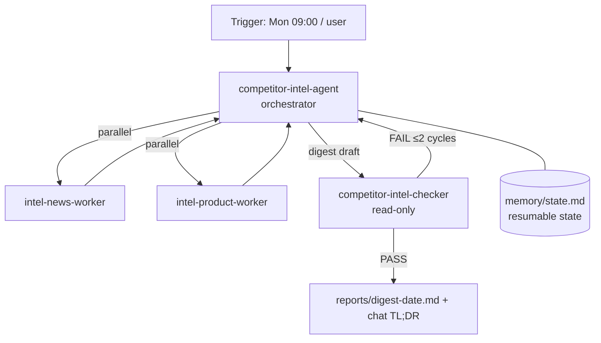

# Agent Intake Form — competitor-intel-agent (WORKED EXAMPLE, Full tier)

> Filled-in example of [templates/00-intake-form.md](../../templates/00-intake-form.md) at the **Full** tier: orchestrator + sub-agents, a scheduled trigger (event-driven loop), maker/checker separation, and resumable state. Competitor names are fictional.

---

## A. Identity

| Field | Answer |
|-------|--------|
| **Agent name** | `competitor-intel-agent` |
| **One-line description** | Delivers a weekly, fully cited competitor-intelligence digest by orchestrating parallel scan workers and an independent checker. |
| **Owner / author** | Zhen Yi |
| **Date** | 2026-07-16 |

## B. Objective (目标)

**Primary objective:**

> Every Monday 09:00, deliver a sourced competitor-intelligence digest — news & funding plus product/pricing changes — for every competitor on the tracked list, graded PASS by an independent checker before delivery.

**Success criteria:**

1. Every competitor in `config/competitors.md` appears in the digest — with findings or an explicit "no change this week" line.
2. Every claim carries an inline citation (source title, URL, accessed date); zero uncited claims.
3. New-vs-known is explicit: every item is tagged **NEW** or **UPDATE**, checked against `memory/` per-competitor files.
4. The digest leads with a TL;DR of ≤200 words consistent with the body.

**Acceptance signal:**

> `competitor-intel-checker` returns verdict **PASS** on the digest — recorded as a verdict line in the week's run log before delivery.

**Non-goals:**

- No investment or strategy advice.
- No paywalled/login-walled sources; public web only.
- No contacting competitors or any outreach.
- Never editing the competitor list — that is user-owned.

## C. Responsibilities (职责)

| # | Responsibility | Trigger (on-demand / scheduled / event) | Expected output |
|---|----------------|------------------------------------------|-----------------|
| R1 | Weekly news & funding scan per competitor | scheduled(Mon 09:00) | Cited findings or "no change" per competitor → digest section |
| R2 | Weekly product/pricing/changelog scan per competitor | scheduled(Mon 09:00) | Cited change items tagged NEW/UPDATE → digest section |
| R3 | Compose, verify, and deliver the weekly digest | scheduled(Mon 09:00), after R1–R2 | `reports/digest-<date>.md` + chat TL;DR, checker-PASSed |
| R4 | Ad-hoc "what changed for competitor X?" mini-brief | on-demand | Short cited brief for one listed competitor |

*(The scheduled trigger on R1–R3 activates the event-driven loop — Element 1 dedup rule and Element 6 resume behavior are mandatory.)*

## D. Architecture Design Structure (架构设计)

**Topology:** ☑ **Orchestrator + sub-agents** — a hub routes to specialized workers.
**Complexity tier:** ☑ **Full** — multi-agent orchestration with DAG workflow; all 15 elements required.

**Structure sketch:**

**Runtime / platform:** ☑ Claude Code (agents + skills + MCP).

## E. Inputs & outputs

| Question | Answer |
|----------|--------|
| **Input modalities** | None for the weekly run (list read from `config/competitors.md`); text for ad-hoc queries |
| **Typical input example** | Weekly: trigger fires, no input. Ad-hoc: "What changed for Acme Agents this month?" |
| **Deliverable format(s)** | Markdown digest (fixed 3-part outline); ad-hoc mini-brief in chat |
| **Delivery channel** | File written to `reports/digest-<yyyy-mm-dd>.md` + chat TL;DR |

## F. Environment & constraints

| Question | Answer |
|----------|--------|
| **External systems** | Web search, web page fetch; local filesystem |
| **Data it may read** | Public web content, `config/competitors.md`, its own `scratch/`, `reports/`, `memory/`; must NOT read `private/` or login-walled pages |
| **Actions requiring human approval** | Editing `config/competitors.md`; any delivery beyond the repo (email, Slack, publishing) |
| **Hard limits** | ≤25 web fetches per worker per run; ≤12 orchestration loops; ≤20 min per run |
| **Escalation path** | On fail-after-retries (worker gap, checker FAIL after 2 cycles, stop condition hit): deliver the digest marked **DRAFT** with a gap report to the owner in chat |
| **Background runs allowed?** | Yes — scheduled runs execute unattended; `memory/state.md` makes them resumable |
| **Compliance / safety** | No PII in digests; no paywalled content; flag unverifiable claims, never fabricate |

## G. Memory & learning

| Question | Answer |
|----------|--------|
| Remember across runs? | Yes — required: NEW/UPDATE tagging depends on per-competitor memory |
| Worth remembering | Per-competitor known items + last-seen dates (semantic); weekly run summaries (episodic); scan strategies that worked (procedural); source reliability |
| Where memory lives | `memory/` directory, file-per-competitor + `MEMORY.md` index + `state.md` run state |
| **Eval cadence** | After each spec change + monthly (hill-climbing loop **required** at Full tier — eval set in [validation-checklist.md](validation-checklist.md), re-scored via the customized `run-evals` skill) |
