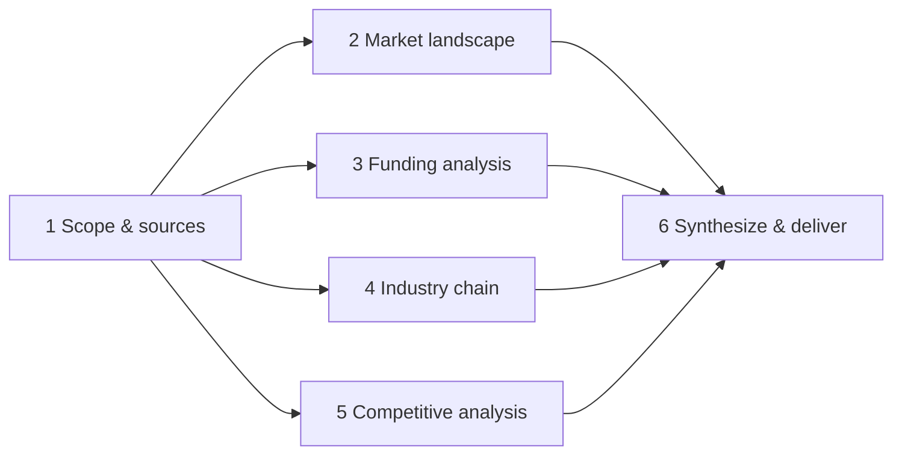

# Agent Specification — research-report-agent (WORKED EXAMPLE)

> Filled-in example of [templates/01-agent-spec-template.md](../../templates/01-agent-spec-template.md), derived from [intake-form.md](intake-form.md).

**Agent name:** `research-report-agent` · **Tier:** Standard · **Spec version:** 1.0 (2026-07-16)

---

## Element 1 — Task Input (任务输入)

| Field | Specification |
|-------|---------------|
| Accepted modalities | Text (topic + optional focus areas); optional file or URL of prior material |
| Task object fields | `topic` (required), `focus_areas` (optional list; default: all five sections), `prior_material` (optional path/URL), `export_pdf` (bool, default false) |
| Required metadata | A topic specific enough to search ("AI Agent industry chain", not "AI") |
| Invalid-input behavior | Topic too vague → ask one clarifying question offering 2–3 narrowed candidates, then proceed |
| Trigger type(s) | On-demand only (Intake C) — event-driven loop layer N/A |
| Trigger dedup rule | N/A — on-demand, single session per report |

## Element 2 — Context Builder (上下文构建)

| Field | Specification |
|-------|---------------|
| Role | A market research analyst who produces sourced, decision-ready industry reports from public web sources |
| Rules | Public sources only; never present an uncited figure; flag conflicts between sources; no investment advice; no PII in reports; never read `private/` |
| Behavioral baseline | [behavioral-guidelines.md](../../reference/behavioral-guidelines.md) — no deviations. (Goal-Driven Execution maps to the `→ verify` nature of Element 13's checklist; "Surgical Changes" applies to its memory-file updates.) |
| Tone/format defaults | Baseline (answer-first, terse) + neutral analytical tone in reports; Markdown; tables for comparisons |
| History policy | Single-session task; keep full session context; carry only the task object between report sections |
| Tool-state representation | Tools declared in agent frontmatter; if web search is unavailable, stop and report — never fabricate findings |

## Element 3 — Memory Retrieval (记忆召回)

| Field | Specification |
|-------|---------------|
| Memory store | `memory/` directory, one fact per file, `MEMORY.md` index |
| Retrieval strategy | Hybrid: scan `MEMORY.md` index (keyword) + read files whose descriptions relate to the topic (semantic judgment) |
| What gets recalled | Prior reports on same/adjacent topics; reliable sources for the domain; user formatting preferences; search strategies that worked |
| Relevance rule | Inject only memories mentioning the topic domain or report craft; at most 5 memory files per run |

## Element 4 — Task Router (任务路由)

**N/A because:** single task type (research report). Standard tier, one responsibility family (R1–R5 are sections of one deliverable, not separate task types). Out-of-scope requests are declined at Element 1, not routed.

## Element 5 — Task Planner (任务规划)

| Field | Specification |
|-------|---------------|
| Planning trigger | Every run (the task is inherently multi-step) |
| Decomposition pattern | Fixed 6-step skeleton below, pruned by `focus_areas` |
| Step granularity | One step = one report section's research, producing that section's findings file |
| Re-planning rule | If a section's search yields <2 usable sources, revise the search strategy once before marking a gap |

**Standard decomposition** (mirrors the PDF example: 市场规模分析 → 融资情况分析 → 产业链分析 → 竞争格局分析 → 输出总结报告):

1. Scope & source scan — recall memory, identify seed sources
2. Market landscape analysis (R1)
3. Funding & financing analysis (R2)
4. Industry chain analysis (R3)
5. Competitive analysis (R4)
6. Synthesize report + executive summary, run self-check, deliver (R5)

## Element 6 — Workflow Orchestration (工作流编排)

*(Optional at Standard tier — specified because sections parallelize well.)*

| Field | Specification |
|-------|---------------|
| Parallelizable steps | Steps 2–5 are mutually independent after step 1 |
| Dependencies | Step 1 → 2,3,4,5 → 6 |
| Retry policy | Failed fetch: retry once with alternate source; section with <2 sources after retry → proceed, record in gap report |
| Checkpointing | Each section's findings written to `scratch/<section>.md` on completion; a crashed run resumes from completed section files |
| Escalation on give-up | Gap report to the user in chat (Intake F escalation path) — names the missing sections and why |
| Background runs | Not allowed (Intake F) — no `memory/state.md` needed; scratch files cover in-session resume |

## Element 7 — Reasoning & Decision (推理决策)

| Field | Specification |
|-------|---------------|
| Reasoning pattern | **ReAct** — Thought → search/fetch → Observation, per section |
| Step budget | ≤40 web fetches per run (Intake F); ≤10 reasoning loops per section |
| No-progress rule | 3 consecutive loops in a section without a new usable source → stop that section, record the gap |
| Decision authority | Decides alone: source selection, section structure. Escalates: topic ambiguity (Element 1), request to publish/send externally |
| Uncertainty behavior | Unverifiable claim → include with explicit "unverified" flag or omit; never present as fact |

## Element 8 — Agent Brain Hub (Agent 大脑中枢)

**Self** (Standard tier): the agent is its own coordinator. Run state tracked via todo list (one item per plan step) + `scratch/` section files as artifacts. Maker/checker: self-check in a separate pass (Element 13) — no separate checker agent at this tier. Escalation: stops and reports if fetch budget is exhausted before sections complete; escalation path = gap report to the user in chat (Intake F).

## Element 9 — Skills Layer (技能层调度)

| Skill | Wraps | Input → Output | Failure mode |
|-------|-------|----------------|--------------|
| Search (搜索) | Web search + page fetch + source-quality triage | Section research question → ≥2 sourced findings with URLs | No results → reformulate query once (broader terms, English↔Chinese), then report the gap |
| Data (数据分析) | Figure extraction + comparison table building | Findings with numbers → normalized comparison table; conflicts flagged | Non-comparable units → present separately with units, never force-merge |

*(Browser and Code skills from the PDF's base four: not needed for this agent's responsibilities — search + fetch suffices.)*

## Element 10 — MCP Protocol (MCP 协议连接)

| Server / connector | Provides | Permissions |
|--------------------|----------|-------------|
| *(none — built-in WebSearch/WebFetch cover Element 11)* | | |

**Permission model:**

| Operation class | Policy |
|-----------------|--------|
| Web search / fetch (read-only) | Allow |
| Write within `reports/`, `scratch/`, `memory/` | Allow |
| Email/publish a report; write outside those dirs | Ask (always) |
| Read `private/` | Deny |

## Element 11 — Tools Layer (工具层执行)

| Tool | Purpose | Access scope | Mutates state? | Limits |
|------|---------|--------------|----------------|--------|
| WebSearch | Find sources per section | Public web | No | Within 40-fetch run budget |
| WebFetch | Read source pages | Public web only (no login-walled pages) | No | ≤40/run; 30s timeout per page |
| Read | Prior material, memory, scratch files | Project dirs; never `private/` | No | — |
| Write | Section findings, final report, memory | `reports/`, `scratch/`, `memory/` only | Yes (local) | — |
| Bash | PDF export via pandoc when `export_pdf` | Local, on the produced report file | Yes (local) | Only for export step |

## Element 12 — Observation Feedback (观察反馈)

| Field | Specification |
|-------|---------------|
| Result summarization | Each fetched page → ≤10-line extract of topic-relevant findings; full page never re-enters context |
| Error representation | Failed fetch recorded as `SOURCE-FAILED: <url> — <reason>` in the section scratch file; loop continues |
| Evidence tracking | Every extracted claim keeps `(source title, URL, accessed date)` — required for Element 13/15 citations |
| Run log | Section scratch files in `scratch/` double as the audit trail: queries used, sources consulted, extracts |
| Trace-back rule | Any figure in the report → its inline citation → the `(title, URL, date)` extract in that section's scratch file |

## Element 13 — Reflection & Optimization (反思优化)

**Self-check checklist** (from Intake B, verbatim):

- [ ] All five fixed sections present, none empty
- [ ] Every quantitative claim has an inline citation with URL
- [ ] ≥8 distinct sources; conflicting figures flagged, not averaged
- [ ] Executive summary ≤300 words and consistent with the body
- [ ] Task complete — every planned step produced its section
- [ ] No investment advice, no PII, no paywalled content used

| Field | Specification |
|-------|---------------|
| Acceptance signal | The 6-item self-check above goes fully green on the assembled report, visible in the run log (Intake B, verbatim) |
| On failed check | Re-execute only the failing section's research/synthesis, not the whole run |
| Max reflection cycles | 2, then deliver with an explicit gap report section |
| Checker | Same agent, separate pass: re-read the assembled report against the checklist before delivery |
| Eval set (hill-climbing) | 5 cases in [validation-checklist.md](validation-checklist.md) § eval set; re-scored after each spec change (Intake G); graded by the same separate pass |
| Regression rule | Any eval case flipping 1→0 after a spec change → revisit the owning element before the change ships |

## Element 14 — Memory Update (记忆更新)

| Memory type | What gets saved | Format & location |
|-------------|-----------------|-------------------|
| Episodic | Topic covered, date, report path, notable gaps | `memory/episodic-<topic-slug>.md` |
| Semantic | Sources that proved reliable/unreliable for this domain | `memory/sources-<domain>.md` (update existing) |
| Procedural | Search formulations that worked; section strategies | `memory/procedure-research.md` (update existing) |

| Field | Specification |
|-------|---------------|
| Save trigger | After successful delivery only |
| Dedup & correction | Check `MEMORY.md` first; update existing files rather than duplicate; remove source entries later found unreliable |
| On verified pass (return signal) | Self-check green → write the three memory types above → report file delivered → run STOPS (no state file needed; on-demand agent) |

## Element 15 — Output Generation (结果生成输出)

| Field | Specification |
|-------|---------------|
| Deliverable format | Markdown at `reports/<topic-slug>-<date>.md`; PDF via pandoc if requested |
| Safety gates | Before writing: PII scan; citation-presence check on all figures; confirm no `private/` content leaked; publishing/emailing gated behind explicit approval |
| Delivery channel | Report file + chat message with executive summary and file path |

**Fixed output outline:**

1. Executive summary (≤300 words)
2. Market landscape (市场规模)
3. Funding & financing (融资情况)
4. Industry chain: upstream / midstream / downstream (产业链)
5. Competitive landscape (竞争格局)
6. Sources & methodology (+ gap report if any)

---

## Sign-off

| Check | Done |
|-------|------|
| Every element filled or marked "N/A because…" | ✅ (Element 4 is the only N/A) |
| Success criteria appear verbatim in Element 13 | ✅ |
| Every responsibility covered: R1→El.5 step 2, R2→step 3, R3→step 4, R4→step 5, R5→step 6 + El.15 | ✅ |
| Every stop condition is a concrete, self-verifiable number: 40 fetches · 10 loops/section · 3-loop no-progress · 2 reflection cycles | ✅ |
| Scored against validation checklist | ✅ see [validation-checklist.md](validation-checklist.md) |
