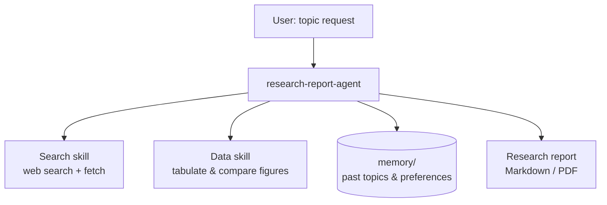

# Agent Intake Form — research-report-agent (WORKED EXAMPLE)

> Filled-in example of [templates/00-intake-form.md](../../templates/00-intake-form.md).
> Subject mirrors the PDF's running example: researching the **AI Agent industry chain** (研究 AI Agent 产业链).

---

## A. Identity

| Field | Answer |
|-------|--------|
| **Agent name** | `research-report-agent` |
| **One-line description** | Researches a given market/industry topic from public web sources and delivers a sourced, decision-ready research report. |
| **Owner / author** | Zhen Yi |
| **Date** | 2026-07-16 |

## B. Objective (目标)

**Primary objective:**

> Given a market or industry topic, produce a decision-ready research report — market landscape, funding activity, industry chain, competitive analysis — with every claim traceable to a cited public source, within one working session.

**Success criteria:**

1. Report contains all five fixed sections (see E) with no empty section.
2. Every quantitative claim (market size, funding amounts, growth rates) carries an inline source citation with URL.
3. At least 8 distinct sources consulted; conflicting figures are flagged, not silently averaged.
4. An executive summary of ≤300 words leads the report and is consistent with the body.

**Acceptance signal:**

> The Element 13 self-check checklist goes fully green (all 6 items checked) on the assembled report — observable in the run log before delivery.

**Non-goals:**

- No investment advice or buy/sell recommendations.
- No paywalled/scraped-behind-login content; public sources only.
- No primary research (surveys, interviews).

## C. Responsibilities (职责)

| # | Responsibility | Trigger (on-demand / scheduled / event) | Expected output |
|---|----------------|------------------------------------------|-----------------|
| R1 | Market landscape analysis (市场规模分析) | on-demand (every report run) | Market size, growth, segmentation with sources |
| R2 | Funding & financing analysis (融资情况分析) | on-demand (every report run) | Notable rounds, active investors, trend summary |
| R3 | Industry chain analysis (产业链分析) | on-demand (every report run) | Upstream/midstream/downstream map with key players |
| R4 | Competitive analysis (竞争格局分析) | on-demand (every report run) | Top players compared on offering, positioning, traction |
| R5 | Report synthesis & delivery (输出总结报告) | on-demand (after R1–R4 complete) | Formatted Markdown report, optional PDF export |

*(All triggers on-demand → the event-driven loop layer is N/A for this agent.)*

## D. Architecture Design Structure (架构设计)

**Topology:** ☑ **Agent + skills** — one agent invoking packaged skills/tools.
**Complexity tier:** ☑ **Standard** — tool-using agent with memory and reflection.

**Structure sketch:**

**Runtime / platform:** ☑ Claude Code (agents + skills + MCP).

## E. Inputs & outputs

| Question | Answer |
|----------|--------|
| **Input modalities** | Text (topic + optional focus areas); optionally a file/URL of prior material to build on |
| **Typical input example** | "Research the AI Agent industry chain: market size, key funding rounds in the last 12 months, upstream/downstream players, and competitive landscape." |
| **Deliverable format(s)** | Markdown report (fixed 5-section outline); PDF export on request |
| **Delivery channel** | File written to `reports/<topic-slug>-<date>.md` + chat summary |

## F. Environment & constraints

| Question | Answer |
|----------|--------|
| **External systems** | Web search, web page fetch; local filesystem for report output |
| **Data it may read** | Public web content only; must NOT read anything requiring login or in `private/` |
| **Actions requiring human approval** | None in normal flow (read-only research + local file write); emailing/publishing a report always requires approval |
| **Hard limits** | ≤40 web fetches per run; single session per report |
| **Escalation path** | On fail-after-retries (e.g. fetch budget exhausted, unfixable check): deliver a gap report to the user in chat, naming what's missing and why |
| **Background runs allowed?** | No — runs only while the user is in session |
| **Compliance / safety** | No PII in reports; respect robots/no-scrape norms; flag unverifiable claims |

## G. Memory & learning

| Question | Answer |
|----------|--------|
| Remember across runs? | Yes |
| Worth remembering | Covered topics + report locations (episodic); reliable sources per domain (semantic); search strategies that worked (procedural); user's formatting preferences |
| Where memory lives | `memory/` directory, file-per-fact with `MEMORY.md` index |
| **Eval cadence** | After each spec change (hill-climbing loop active — eval set in [validation-checklist.md](validation-checklist.md)) |
