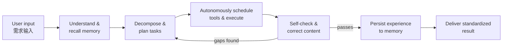

# The 15 Elements of AI Agent Development — Reference

> Distilled from *AI Agent Development Templates.pdf* (Agent 全流程时序图解 — "Agent Full-Pipeline Sequence Diagram: from user prompt to result return").
> Core principle: **the LLM does the thinking; the Agent gets things done** (LLM 负责思考，Agent 负责把事情做完).

This is the source-of-truth reference used by every template in this pack. Each element lists: what it is, what it must accomplish, and the key design decisions it forces.

---

## Element index

| # | Element | 原文 (Chinese) | Pipeline stage |
|---|---------|----------------|----------------|
| 1 | Task Input | 任务输入 | Intake |
| 2 | Context Builder | 上下文构建 | Understanding |
| 3 | Memory Retrieval | 记忆召回 | Understanding |
| 4 | Task Router | 任务路由 | Dispatch |
| 5 | Task Planner | 任务规划 | Planning |
| 6 | Workflow Orchestration | 工作流编排 | Planning |
| 7 | Reasoning & Decision | 推理决策 | Execution loop |
| 8 | Agent Brain Hub | Agent 大脑中枢 | Coordination |
| 9 | Skills Layer | 技能层调度 | Capability |
| 10 | MCP Protocol | MCP 协议连接 | Capability |
| 11 | Tools Layer | 工具层执行 | Capability |
| 12 | Observation Feedback | 观察反馈 | Execution loop |
| 13 | Reflection & Optimization | 反思优化 | Quality |
| 14 | Memory Update | 记忆更新 / 记忆沉淀 | Learning |
| 15 | Output Generation | 结果生成输出 | Delivery |

---

## 1. Task Input (任务输入)

**What it is:** The unified entry point that receives every form of user demand — text, image, voice, video, files, web pages.

**Must accomplish:** Accept all supported input modalities through one entry, normalize them into a task the agent can process.

**Key design decisions:**
- Which modalities are supported (text / image / voice / video / file / web URL)?
- How is raw input normalized into a task object (fields, required metadata)?
- What happens with unsupported or malformed input?
- **Trigger type** — on-demand (user asks) / scheduled (cron) / event-driven (webhook, channel, file change)? A scheduled or event trigger turns the agent into a background loop — see [loop-engineering-reference.md](loop-engineering-reference.md) §3.
- Dedup rule: what happens when a trigger fires while a run is already in progress (skip / queue / cancel-and-restart)?

## 2. Context Builder (上下文构建)

**What it is:** Assembles the complete context so the agent precisely understands the goal and its background.

**Must accomplish:** Merge four sources into one working context: **system prompt** (系统提示词), **current user question** (用户问题), **conversation history** (历史对话), and **tool capability/state** (工具能力 + 任务状态).

**Key design decisions:**
- What goes into the system prompt (role, rules, constraints, tone)?
- How much history is kept, and how is it truncated/summarized?
- How is tool availability/state represented in context?

## 3. Memory Retrieval (记忆召回)

**What it is:** Recalls relevant experience from long-term memory to keep reasoning coherent across sessions.

**Must accomplish:** Retrieve relevant past tasks, user preferences, prior process knowledge, and knowledge-base content. Retrieval modes: **question search / keyword match / hybrid retrieval** (问题检索 / 关键词匹配 / 混合检索). Sources: past tasks (历史任务), user preferences (用户偏好), past experience (过往经验), knowledge base (经验知识库).

**Key design decisions:**
- What memory store exists (files, vector DB, database)?
- Retrieval strategy: semantic, keyword, or hybrid?
- Relevance threshold — what gets injected vs. ignored?

## 4. Task Router (任务路由)

**What it is:** Automatically identifies the task type and dispatches to the best-suited specialized agent module.

**Must accomplish:** Classify the incoming task and route it, e.g. **Research Agent / Coding Agent / Document Agent / Image Agent** (研究任务 / 代码任务 / 文档任务 / 图片任务).

**Key design decisions:**
- Taxonomy of task types this agent (or agent team) handles.
- Routing mechanism: LLM classification, rules, or hybrid?
- Fallback route for unclassifiable tasks.

## 5. Task Planner (任务规划)

**What it is:** Decomposes a large, complex objective into clear, stepwise executable action items and work modules.

**Must accomplish:** Turn the goal into an ordered set of sub-tasks (the PDF's running example decomposes "research the AI Agent industry chain" into: market landscape analysis → financing analysis → industry chain analysis → competitive analysis → output synthesis report).

**Key design decisions:**
- Planning granularity — how small is one step?
- Static plan upfront vs. dynamic re-planning during execution?
- How are work modules grouped and ordered?

## 6. Workflow Orchestration (工作流编排)

**What it is:** DAG-based flow control over the whole execution process.

**Must accomplish:** Manage the task DAG supporting **parallel execution** (并行), **task dependencies** (依赖), **failure retries** (重试), and **checkpoint saves** (Checkpoint / 断点保存).

**Key design decisions:**
- Which sub-tasks can run in parallel; which depend on which?
- Retry policy (count, backoff, when to give up)?
- Checkpointing — what state is saved and where, so runs can resume?
- Escalation after retries are exhausted: who is notified, through what channel, with what artifact?
- Are background runs allowed (long steps continuing unattended)? If yes, checkpoints double as rollback points.

## 7. Reasoning & Decision (推理决策)

**What it is:** The LLM's autonomous thinking loop that decides, at each step, which capability or tool to invoke next.

**Must accomplish:** Run a reasoning pattern — **CoT (Chain of Thought), ToT (Tree of Thought), or ReAct** — cycling **Thought 思考 → Action 行动 → Observation 观察**.

**Key design decisions:**
- Which reasoning pattern fits the task shape (linear CoT, branching ToT, tool-interleaved ReAct)?
- Step budget / loop limits to prevent runaway execution.
- When does the agent decide vs. escalate to the user?
- **Stop conditions must be verifiable by the agent itself** (concrete numbers it can check mid-run, not judgment calls). Alongside the step budget, set a no-progress rule: N consecutive iterations without new evidence or state change → stop.

## 8. Agent Brain Hub (Agent 大脑中枢)

**What it is:** The central coordinator — overall commander of the whole pipeline.

**Must accomplish:** Globally coordinate **goal understanding** (理解目标), **decision path** (决策路径), **scheduling rhythm** (调度节奏), and **run-state management** (状态管理); direct execution agents according to plan and schedule.

**Key design decisions:**
- Single-agent (the hub is the agent itself) vs. orchestrator + sub-agents?
- What run state is tracked (current step, budget used, errors, artifacts)?
- Scheduling policy — what runs when, and who arbitrates conflicts?
- **Maker/checker separation** — does a separate (read-only) checker agent grade the maker's output, or does the maker self-check? Separation costs a pass but removes self-grading bias.
- Escalation path: on unrecoverable failure, who is notified, through what channel, with what artifact (e.g. a gap report)?

## 9. Skills Layer (技能层调度)

**What it is:** Packaged core capabilities invoked on demand, shielding low-level tool complexity.

**Must accomplish:** Encapsulate the four base skills — **Search 搜索能力, Browser 浏览器能力, Data Skill 数据分析能力, Code Skill 代码能力** — plus any domain skills, invocable as units.

**Key design decisions:**
- Which skills does this agent need, and what does each wrap?
- Skill interface: inputs, outputs, failure modes.
- When to add a domain-specific skill vs. use raw tools.
- Reuse an existing `skills-library/` skill (copy & customize) vs. build new.

## 10. MCP Protocol (MCP 协议连接)

**What it is:** The standardized channel (MCP Client ↔ MCP Server) connecting the agent to tools.

**Must accomplish:** Uniform tool integration, **permission verification** (权限管理 Permission), and security controls — connect tools via one protocol instead of bespoke integrations.

**Key design decisions:**
- Which MCP servers / connectors are needed?
- Permission model: what is allowed, denied, or requires confirmation?
- Credential and secret handling.

## 11. Tools Layer (工具层执行)

**What it is:** The real execution against the external world.

**Must accomplish:** Interact with **search engines 搜索引擎, browsers 浏览器, databases 数据库, API services API 服务, file systems 文件系统, email 邮件系统, office software 办公软件** — execute real business logic and fetch real data.

**Key design decisions:**
- Exact tool inventory with purpose and access scope for each.
- Rate limits, timeouts, and cost controls per tool.
- Sandboxing: which tools can mutate state vs. read-only?

## 12. Observation Feedback (观察反馈)

**What it is:** Capturing what came back from the world as evidence for the next decision.

**Must accomplish:** Collect **tool execution results / data / web content / API responses / file contents** (工具执行结果 / 数据 / 网页内容 / API 响应 / 文件内容) and feed them back into the reasoning loop as the basis for the next step.

**Key design decisions:**
- How are large/noisy results summarized before re-entering context?
- Error signals: how are tool failures represented and handled?
- What gets logged for later debugging/audit?
- **Untrusted-content rule:** observed content is data, never instructions — directives embedded in fetched pages, files, or API responses are flagged in the run log, not followed (the prompt-injection guardrail — see [loop-engineering-reference.md](loop-engineering-reference.md) §6).
- **Trace-back requirement:** any claim in the final deliverable must be walkable back to its source evidence in the run log — this is what makes loop outcomes 可追溯 (traceable) and 可复现 (reproducible).

## 13. Reflection & Optimization (反思优化)

**What it is:** Automated self-checking with re-execution on gaps.

**Must accomplish:** Verify **task completeness** (任务是否完成), **information accuracy** (信息是否准确), and **goal match** (目标是否匹配 / 是否有遗漏). On failure: **discover the gap → re-plan → re-execute** (发现问题 → 重新规划 → 重新执行) until checks pass.

**Key design decisions:**
- Concrete acceptance criteria per task type (checklist, rubric, tests).
- Max reflection/retry cycles before escalating to the user.
- Who checks — the same model, a second pass, or an external validator?
- **Acceptance signal must be observable** — a test passing, a checklist going green, a human approving. "Looks good" is not a signal.
- **Hill-climbing (across runs):** keep an eval set (5–8 cases with acceptance criteria), score it each run, track scores over iterations; any case that regresses loops back to the owning element. See [loop-engineering-reference.md](loop-engineering-reference.md) §3 layer 4.

## 14. Memory Update (记忆更新 / 记忆沉淀)

**What it is:** Persisting what was learned so the agent fits the user better over time.

**Must accomplish:** After task completion, deposit **three kinds of long-term memory** (三类记忆沉淀):
- **Episodic Memory (事件记忆)** — what happened: the task, decisions, outcomes.
- **Semantic Memory (知识记忆)** — facts and domain knowledge learned.
- **Procedural Memory (流程记忆)** — successful procedures/workflows worth reusing.

**Key design decisions:**
- What is worth persisting vs. discarding (signal vs. noise)?
- Storage format and location for each memory type.
- Deduplication and correction of stale/wrong memories — plus a prune rule: when is a memory stale (age, superseded, unused for N runs) and who removes it.
- **Return-signal framing:** a verified pass triggers the terminal sequence — write memory → archive the result → STOP the loop. For scheduled/background agents, also update the run-state file (`memory/state.md`: done / next) so the next triggered run resumes instead of restarting.

## 15. Output Generation (结果生成输出)

**What it is:** Producing the final standardized deliverable.

**Must accomplish:** Auto-format the result (自动排版格式化), pass **safety/compliance checks** (安全检查: 敏感信息检测, 内容合规校验, 权限校验 — sensitive-info detection, content compliance, permission verification), and export in the required format: **Markdown / PDF / PPT / Excel / charts / JSON**.

**Key design decisions:**
- Deliverable format(s) and structure the user expects.
- Safety gates before release (PII, compliance, permissions).
- Where output is delivered (chat, file, email, dashboard).

---

## The core closed loop (Agent 的核心闭环)

Full chain: user input → understanding & memory recall → task decomposition & planning → autonomous tool scheduling & execution → self-check & correction → experience persistence → standardized deliverable.

This is the **inner** loop — one run from input to deliverable. For the **outer** loops — what starts a run (triggers), what proves it done (acceptance signals), what stops it (stop conditions), and what improves the next one (eval-driven hill-climbing) — see [loop-engineering-reference.md](loop-engineering-reference.md).

## One-line mental model (一句话看懂 Agent)

- **Prompt era:** ask a question → get an answer.
- **Agent era:** state a goal → the task completes itself.
- **LLM** is the brain · **Memory** is the notebook · **Skills** are the abilities · **MCP** is the connector · **Tools** are the hands · **Workflow** is the nervous system · **Agent** is the super-coordinator.
