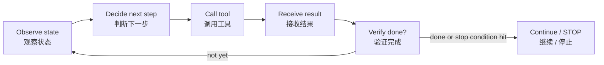
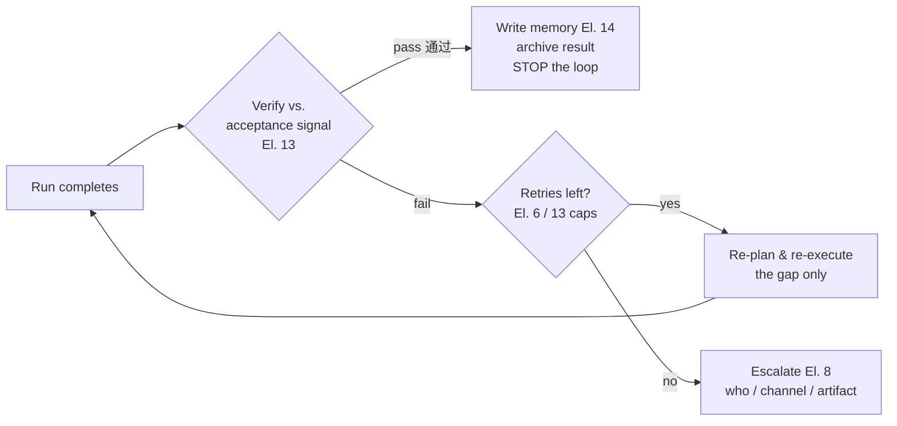
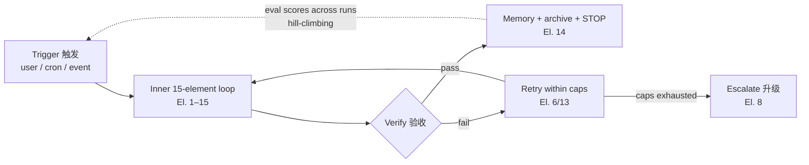

# Loop Engineering — Reference

> Distilled from the two source infographics in the pack root: *Loop Engineering.png* (Loop Engineering 和其他概念的关系) and *Loop Engineering 2.png* (什么是 Loop Engineering).
> Core principle: **design reliable loops by letting the system act continuously while judgment, acceptance, and responsibility stay explicit** (让系统持续行动，同时让判断、验收和责任保持清晰).

This doc is the consolidated map of Loop Engineering onto the [15 elements](15-elements-reference.md). It adds **no new elements** — every loop concept lives inside the element that owns it. Use this doc to see the whole loop at once; use the element sections in the spec template to fill in the details.

---

## 1. What Loop Engineering is (什么是 Loop Engineering)

Making a system continuously **trigger 触发 → execute 执行 → verify 检查 → remember 记忆 → retry/escalate/stop 重试/升级/停止** around a goal.

It sits *above* the other disciplines and wires their **return signals (返回信号)** into a repeatable feedback system:

| Layer | Discipline | Question it answers | In this pack |
|-------|-----------|---------------------|--------------|
| Inner input (内层输入) | Prompt Engineering | 单次怎么问 — how to ask once | Element 2 (system prompt) |
| Inner input | Context Engineering | 给它看什么 — what to show it | Elements 2–3 |
| Mid-layer action (中层行动) | Agent / Tool Use | 调用工具行动 — act via tools | Elements 7, 9–12 |
| Mid-layer action | Harness Engineering | 受控运行环境 — controlled environment | Elements 10–11 (permissions, limits) |
| Outer system (外层系统) | Workflow Automation | 事件触发任务 — events feed tasks in | Elements 1, 6 |
| Outer system | **Loop Engineering** | 持续反馈系统 — keep looping until verified done | The whole closed loop + this doc |

**One-line contrast:** prompt engineering optimizes a single ask; Loop Engineering makes the system keep doing, checking, and improving until the goal is verifiably met — or a stop condition fires.

## 2. The minimal closed loop (最小闭环)

A loop is only engineerable when all six prerequisites exist. Each is supplied by a specific part of the pack:

| Prerequisite | 原文 | Supplied by |
|--------------|------|-------------|
| Goal | 目标 | Intake B (objective) |
| State | 状态 | Element 8 (run state) · `memory/state.md` for resumable runs |
| Tools | 工具 | Elements 9–11 |
| Feedback | 反馈 | Element 12 (observation) |
| Acceptance | 验收 | Intake B acceptance signal → Element 13 checklist |
| Stop conditions | 停止条件 | Element 7 (step budget, no-progress rule) · Element 13 (cycle cap) |

If any row is missing, the loop will improvise there — and improvisation is where loops run away or stall.

## 3. The four-layer loop stack (四层 loop stack)

| # | Loop layer | What it does | Owned by | Applicability |
|---|-----------|--------------|----------|---------------|
| 1 | **Agent loop** | Tool calls with direct feedback (Thought → Action → Observation) | Elements 7 + 12 | All tiers — native |
| 2 | **Verification loop** | Check output against acceptance criteria; re-execute gaps | Element 13 (+ Intake B criteria) | All tiers (Lite: light self-check) |
| 3 | **Event-driven loop** | cron / webhook / channel triggers; background runs; the agent runs without a human pressing go | Element 1 (trigger types) + Element 6 (background, resume) | Any tier — only if Intake C declares a scheduled/event trigger |
| 4 | **Hill-climbing loop** | Eval-driven improvement across runs: prove, test, grade, review; scores tracked over iterations | Element 13 (eval set) + [validation checklist](../templates/04-validation-checklist.md) eval table | Standard: optional · Full: required |

Layers 1–2 run *inside* a single run. Layers 3–4 run *around* runs: layer 3 starts them, layer 4 improves the next one.

## 4. The six engineering components (六个工程构件)

| Component | 原文 | Maps to |
|-----------|------|---------|
| **Automations** | 定制化规则和分发 | Element 4 (routing rules) · Element 6 (orchestration) · Element 1 triggers |
| **Worktrees** | 隔离并行 agent | Element 6 (parallel isolation — git worktrees in the [Claude Code mapping](../templates/03-claude-code-mapping.md)) |
| **Skills** | 沉淀项目知识 | Element 9 + the [skills library](../skills-library/README.md) |
| **Connectors** | 接入真实工具 | Elements 10–11 (MCP + tools) |
| **Sub-agents** | maker/checker 分离 | Element 8 (topology) · Element 13 checker field (separate review pass) |
| **Memory/state** | 记住已做和下一步 | Elements 3 + 14 · Element 6 checkpoints · `memory/state.md` |

## 5. Return signals (返回信号)

Evaluation / human review produces the signal that decides what the loop does next:

Two rules make return signals engineerable:
- **Pass must be observable** — a test passing, a checklist going green, a human approving. "Looks good" is not a signal (Element 13's acceptance signal field).
- **Fail must have a bounded path** — retry within caps (Elements 6/13), then escalate through a declared path (Element 8) with an artifact (gap report), never silently loop forever.

## 6. Guardrails (护栏) — the consolidated view

Every guardrail from the source images lives in a specific element field. This table is the audit surface — check it when reviewing any spec:

| Guardrail | 原文 | Lives in |
|-----------|------|----------|
| **Verifiable stop conditions** — explicit, testable, checkable by the agent itself | 停止条件明确、可测、可验证 | Element 7 (step budget, no-progress rule) · Element 13 (cycle cap) |
| **Human approval for high-risk actions** — external systems, decisions | 高风险动作人工审批 | Intake F → Element 10 permission model (ask/deny) |
| **Token / time / rate caps** — control cost & risk, prevent infinite loops | token/时间/速率上限, 防止无限循环 | Intake F hard limits → Element 11 per-tool limits |
| **Trace, versioning, rollback points** — traceable, reproducible, revertible | trace、版本、回滚点 — 可追溯、可回滚 | Element 12 (run log, evidence) · Element 6 (checkpoints) |
| **Keep human understanding** — explainable, trustworthy, human-AI collaboration | 保持人的理解 — 可解释、可信任、人机协作 | [behavioral-guidelines.md](behavioral-guidelines.md) § Loop discipline · Element 8 escalation |

## 7. Relationship to the core closed loop

The [15-element closed loop](15-elements-reference.md#the-core-closed-loop-agent-的核心闭环) is the **inner** loop — one run from input to deliverable. Loop Engineering adds the **outer** rings:

- **What starts a run** — Element 1's trigger types (on-demand / scheduled / event).
- **What proves it done** — Element 13's acceptance signal, verified, not vibes.
- **What stops it** — Element 7/13's stop conditions, hit by the agent itself.
- **What improves the next one** — the eval set scored across runs (hill-climbing), regressions looping back to the owning element.

