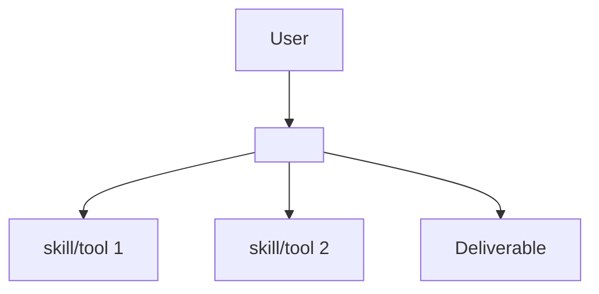

# Agent Intake Form (Template 00)

> **This form is the single input to the whole template system.** Fill it in first.
> The three core inputs — **Responsibilities**, **Objective**, and **Architecture Design Structure** — drive every one of the 15 elements in the [agent spec template](01-agent-spec-template.md). See the derivation map at the bottom.

---

## A. Identity

| Field | Your answer |
|-------|-------------|
| **Agent name** | *(kebab-case, e.g. `invoice-audit-agent`)* |
| **One-line description** | *(what it does, for whom, in one sentence)* |
| **Owner / author** | |
| **Date** | |

## B. Objective (目标) — *the WHY*

> The single outcome this agent exists to achieve. If you can't state it in 1–2 sentences, the agent is not ready to be specified.

**Primary objective:**

> *(e.g., "Produce a decision-ready weekly market research report on <domain> with sourced data, in under 30 minutes per run.")*

**Success criteria** *(measurable — these become the Reflection checks in Element 13 and the validation gate)*:

1.
2.
3.

**Acceptance signal** *(the single observable proof a run is DONE — a test passing, a checklist going green, a human approving. Must be verifiable, not "looks good". Becomes Element 13's pass signal and the loop's stop-on-success condition)*:

>

**Non-goals** *(explicitly out of scope — prevents scope creep in routing and planning)*:

-

## C. Responsibilities (职责) — *the WHAT*

> List every duty the agent owns. Each responsibility becomes routable task types (Element 4), required skills (Element 9), and required tools (Elements 10–11).
> **Trigger values:** `on-demand` (user asks) · `scheduled(<cron>)` (e.g. `scheduled(Mon 09:00)`) · `event(<source>)` (e.g. `event(new file in inbox/)`). Any scheduled/event trigger activates the event-driven loop — see Element 1 and [loop-engineering-reference.md](../reference/loop-engineering-reference.md) §3.

| # | Responsibility | Trigger (on-demand / scheduled / event) | Expected output |
|---|----------------|------------------------------------------|-----------------|
| R1 | | | |
| R2 | | | |
| R3 | | | |

## D. Architecture Design Structure (架构设计) — *the HOW*

> Sketch the intended structure. This drives the Brain Hub (Element 8), Workflow Orchestration (Element 6), and MCP topology (Element 10).

**Topology** *(pick one)*:
- [ ] **Single agent** — one agent does everything (→ Lite/Standard tier)
- [ ] **Agent + skills** — one agent invoking packaged skills/tools (→ Standard tier)
- [ ] **Orchestrator + sub-agents** — a hub routes to specialized workers (→ Full tier)

**Complexity tier** *(determines which of the 15 elements are mandatory — see the [applicability matrix](02-development-guideline.md#element-applicability-matrix))*:
- [ ] **Lite** — single-purpose, few tools, linear flow
- [ ] **Standard** — tool-using agent with memory and reflection
- [ ] **Full** — multi-agent orchestration with DAG workflows

**Structure sketch** *(boxes and arrows — replace the placeholder)*:

**Runtime / platform** *(where will it run?)*:
- [ ] Claude Code (agents + skills + MCP) — use [03-claude-code-mapping.md](03-claude-code-mapping.md)
- [ ] Claude API / Agent SDK
- [ ] Other framework: ___________

## E. Inputs & outputs

| Question | Your answer |
|----------|-------------|
| **Input modalities** (text / file / image / voice / web URL / structured data) | |
| **Typical input example** (paste a realistic one) | |
| **Deliverable format(s)** (Markdown / PDF / Excel / JSON / chart / code / email) | |
| **Delivery channel** (chat reply / file / email / dashboard) | |

## F. Environment & constraints

| Question | Your answer |
|----------|-------------|
| **External systems it must touch** (APIs, DBs, sites, office tools) | |
| **Data it may read** (and anything it must NOT read) | |
| **Actions requiring human approval** (sends, deletes, purchases…) | |
| **Hard limits** (time budget per run, cost budget, rate limits) | |
| **Escalation path** (on fail-after-retries: who is notified, via what channel, with what artifact — e.g. "gap report to owner in chat") | |
| **Background runs allowed?** (yes/no — may the agent run unattended? affects the approval design above) | |
| **Compliance / safety requirements** (PII, confidentiality, regulatory) | |

## G. Memory & learning

| Question | Your answer |
|----------|-------------|
| Should the agent remember across runs? (yes/no) | |
| What is worth remembering? (user preferences / domain facts / successful procedures) | |
| Where does memory live? (files / vector DB / database) | |
| **Eval cadence** (never / after each spec change / weekly — activates the hill-climbing loop: the eval set in the [validation checklist](04-validation-checklist.md) is re-scored at this cadence) | |

---

## Derivation map — where each answer flows

| Intake section | Feeds spec element(s) |
|----------------|------------------------|
| B. Objective + success criteria + acceptance signal | 5 Planner · 13 Reflection (acceptance signal = pass signal) · 15 Output · validation gate |
| C. Responsibilities + trigger types | 4 Router · 9 Skills · 11 Tools · 1 Task Input (trigger type → event-driven loop) |
| D. Architecture structure | 6 Workflow · 8 Brain Hub · 10 MCP topology |
| E. Inputs & outputs | 1 Task Input · 15 Output Generation |
| F. Environment & constraints (incl. escalation path, background runs) | 2 Context Builder · 10 MCP permissions · 11 Tools scope/caps · 6 Workflow (escalation) · 8 Brain Hub (escalation path) |
| G. Memory & learning (incl. eval cadence) | 3 Memory Retrieval · 14 Memory Update · 13 Reflection (hill-climbing eval set) |

**Next step:** take this completed form into [01-agent-spec-template.md](01-agent-spec-template.md) and specify each element, following [02-development-guideline.md](02-development-guideline.md).
