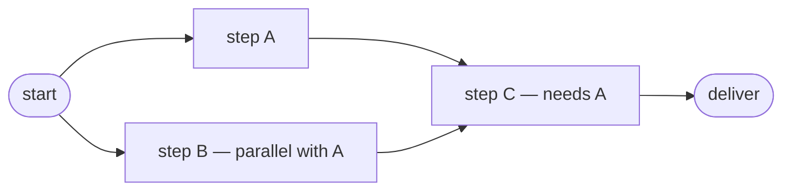
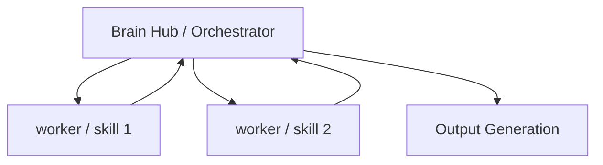

# Agent Specification Template (Template 01) — The 15 Elements

> **Input:** a completed [00-intake-form.md](00-intake-form.md).
> **Output:** a complete agent specification, one section per element.
> **Tier tags:** each element is marked for **Lite / Standard / Full** tiers. Skip elements not required by your tier (see the [applicability matrix](02-development-guideline.md#element-applicability-matrix)) — but record *"N/A because…"* rather than deleting the section, so the decision is visible.
>
> Background on every element: [15-elements-reference.md](../reference/15-elements-reference.md).

---

**Agent name:** `<from intake A>`
**Tier:** Lite / Standard / Full
**Spec version / date:**

---

## Element 1 — Task Input (任务输入)

**Tier:** Lite · Standard · Full (always required)
**Derive from:** Intake E (input modalities, typical input), C (trigger types)

| Field | Specification |
|-------|---------------|
| Accepted modalities | *(text / file / image / voice / web URL / structured data)* |
| Task object fields | *(what the normalized task looks like: goal, inputs, deadline, priority…)* |
| Required metadata | *(what must accompany a request for it to be actionable)* |
| Invalid-input behavior | *(reject with message / ask clarifying question / best-effort)* |
| Trigger type(s) | *(on-demand / scheduled(cron) / event(source) — from Intake C; scheduled/event activates the event-driven loop)* |
| Trigger dedup rule | *(trigger fires mid-run: skip / queue / cancel-and-restart — N/A if on-demand only)* |

**Options & trade-offs:** Fewer modalities = simpler validation. If files are accepted, define size/type limits now, not in production. A scheduled/event trigger makes the agent a background loop — Element 6 must then define resume behavior and Element 7's stop conditions become safety-critical.

## Element 2 — Context Builder (上下文构建)

**Tier:** Lite · Standard · Full (always required)
**Derive from:** Intake B (objective), F (constraints)

| Field | Specification |
|-------|---------------|
| System prompt: role | *(who the agent is, in 1–2 sentences)* |
| System prompt: rules | *(hard behavioral rules, constraints from Intake F)* |
| Behavioral baseline | All agents inherit [behavioral-guidelines.md](../reference/behavioral-guidelines.md) (Think Before Coding · Simplicity First · Surgical Changes · Goal-Driven Execution + communication style). *(record any deviations here; otherwise "baseline, no deviations")* |
| System prompt: tone/format defaults | *(baseline: answer-first, terse, casual English — override only if this agent needs different)* |
| History policy | *(how much conversation history; summarize after N turns?)* |
| Tool-state representation | *(how the agent knows which tools are available/authorized)* |

**Options & trade-offs:** Long system prompts dilute attention — put stable rules in the system prompt, per-task details in the task object. Summarize history rather than truncating mid-task. Don't restate the behavioral baseline verbatim per agent — reference it and specify only deviations.

## Element 3 — Memory Retrieval (记忆召回)

**Tier:** Standard · Full (Lite: optional)
**Derive from:** Intake G (memory & learning)

| Field | Specification |
|-------|---------------|
| Memory store | *(files / vector DB / database — and location)* |
| Retrieval strategy | *(keyword / semantic / hybrid)* |
| What gets recalled | *(past tasks, user preferences, domain knowledge, procedures)* |
| Relevance rule | *(when is a memory injected into context vs. ignored?)* |

**Options & trade-offs:** File-based memory (one fact per file + an index) is simplest and auditable; vector DBs pay off only at scale. Hybrid retrieval (keyword + semantic) is the PDF's default.

## Element 4 — Task Router (任务路由)

**Tier:** Full (Standard: only if >1 task type; Lite: N/A)
**Derive from:** Intake C (responsibilities → task taxonomy)

| Task type | Detection signal | Routed to (module / sub-agent) |
|-----------|------------------|--------------------------------|
| | | |
| | | |
| *(fallback)* | anything unmatched | *(default handler / ask user)* |

**Options & trade-offs:** LLM classification is flexible but costs a call; keyword rules are cheap but brittle. In Claude Code, routing is done by the orchestrator reading each sub-agent's `description` — write descriptions as routing rules.

## Element 5 — Task Planner (任务规划)

**Tier:** Lite · Standard · Full (always required)
**Derive from:** Intake B (objective), C (responsibilities)

| Field | Specification |
|-------|---------------|
| Planning trigger | *(plan every run? only for multi-step tasks?)* |
| Decomposition pattern | *(the standard sub-task breakdown for this agent's main job)* |
| Step granularity | *(one step = one tool call? one deliverable section?)* |
| Re-planning rule | *(when does the plan get revised mid-run?)* |

**Standard decomposition of the primary objective** *(fill in — this is the agent's default plan skeleton)*:

1.
2.
3.
4. Synthesize & deliver

**Options & trade-offs:** Static plans are predictable and testable; dynamic re-planning handles surprises but needs loop limits (set them in Element 7).

## Element 6 — Workflow Orchestration (工作流编排)

**Tier:** Full (Standard: optional; Lite: N/A — linear flow)
**Derive from:** Intake D (architecture structure)

| Field | Specification |
|-------|---------------|
| Parallelizable steps | *(which sub-tasks are independent?)* |
| Dependencies | *(step X needs output of step Y)* |
| Retry policy | *(retries per step, backoff, give-up behavior)* |
| Checkpointing | *(what state is saved, where, resume behavior — checkpoints double as rollback points)* |
| Escalation on give-up | *(retries exhausted: who is notified, channel, artifact — from Intake F escalation path)* |
| Background runs | *(allowed? — from Intake F; if yes: what state file lets the next run resume, e.g. `memory/state.md`)* |

**Task DAG** *(replace placeholder with your real steps)*:

**Options & trade-offs:** Parallelism speeds runs but complicates failure handling. If any step is expensive, checkpoint before it.

## Element 7 — Reasoning & Decision (推理决策)

**Tier:** Lite · Standard · Full (always required)
**Derive from:** task shape (linear vs. exploratory vs. tool-heavy)

| Field | Specification |
|-------|---------------|
| Reasoning pattern | **CoT** (linear think-then-answer) / **ToT** (explore alternatives, pick best) / **ReAct** (Thought → Action → Observation loop with tools) |
| Step budget | *(max reasoning/tool loops per run — a concrete number)* |
| No-progress rule | *(N consecutive iterations without new evidence or state change → stop)* |
| Decision authority | *(what the agent decides alone vs. escalates to the user)* |
| Uncertainty behavior | *(guess & flag / ask / stop)* |

**Options & trade-offs:** ReAct is the default for tool-using agents. ToT costs multiples more — reserve for genuinely branching decisions. Always set a step budget; runaway loops are the #1 agent failure. **Every stop condition here must be verifiable by the agent itself** — concrete numbers it can check mid-run, not judgment calls (see [loop-engineering-reference.md](../reference/loop-engineering-reference.md) §6).

## Element 8 — Agent Brain Hub (Agent 大脑中枢)

**Tier:** Full (Standard: the agent itself is the hub — state that; Lite: N/A)
**Derive from:** Intake D (topology)

| Field | Specification |
|-------|---------------|
| Coordinator | *(orchestrator agent name, or "self")* |
| Run state tracked | *(current step, artifacts produced, budget consumed, errors)* |
| Scheduling policy | *(what runs when; sequential vs. dispatch-and-wait)* |
| Maker/checker separation | *(self-check only / separate read-only checker agent grades the output — Full tier default: separate)* |
| Escalation | *(conditions that stop the run and surface to the user)* |
| Escalation path | *(who is notified, via what channel, with what artifact — from Intake F)* |

**Architecture diagram** *(replace placeholder)*:

**Options & trade-offs:** Don't build an orchestrator for one worker. Sub-agents earn their cost when tasks are parallel, long, or need isolated context.

## Element 9 — Skills Layer (技能层调度)

**Tier:** Standard · Full (Lite: optional — raw tools may suffice)
**Derive from:** Intake C (responsibilities → capabilities needed)

| Skill | Wraps (tools/logic) | Input → Output | Failure mode |
|-------|---------------------|----------------|--------------|
| *(e.g. Search)* | *(web search + fetch)* | *(query → sourced findings)* | *(no results → widen query once, then report gap)* |
| | | | |

**Options & trade-offs:** A skill = a reusable, named procedure with a contract. Create one when the same multi-tool sequence recurs; otherwise call tools directly. The PDF's four base skills: Search, Browser, Data analysis, Code.

## Element 10 — MCP Protocol (MCP 协议连接)

**Tier:** Standard · Full (Lite: only if external tools are used)
**Derive from:** Intake D (runtime), F (external systems, approvals)

| MCP server / connector | Provides | Permissions |
|------------------------|----------|-------------|
| | | allow / ask / deny per operation |

**Permission model:**

| Operation class | Policy |
|-----------------|--------|
| Read-only queries | *(allow)* |
| State-mutating actions | *(ask / allow-listed only)* |
| Destructive / outward-facing (send, delete, pay) | *(always ask — from Intake F)* |

**Options & trade-offs:** Default-deny then allow-list beats default-allow then patch. Secrets live in server config/env, never in prompts or specs.

## Element 11 — Tools Layer (工具层执行)

**Tier:** Lite · Standard · Full (always required — even Lite agents usually read/write something)
**Derive from:** Intake C (responsibilities), F (external systems)

| Tool | Purpose | Access scope | Mutates state? | Limits (rate/time/cost) |
|------|---------|--------------|----------------|--------------------------|
| | | | read-only / write | |
| | | | | |

**Options & trade-offs:** Give the minimum toolset that covers the responsibilities — every extra tool is attack surface and distraction. Set timeouts per tool now.

## Element 12 — Observation Feedback (观察反馈)

**Tier:** Lite · Standard · Full (always required)
**Derive from:** Element 11's tool inventory

| Field | Specification |
|-------|---------------|
| Result summarization | *(how large tool outputs are condensed before re-entering context)* |
| Error representation | *(how a failed tool call is surfaced to the reasoning loop)* |
| Evidence tracking | *(are sources/URLs/query params kept for citation?)* |
| Run log | *(what is logged, where, for audit/debugging — one trace line per loop iteration: what was tried, what the signal said)* |
| Trace-back rule | *(how a claim in the deliverable is walked back to its source evidence in the log)* |

**Options & trade-offs:** Summarize aggressively but keep provenance — a conclusion without its source can't pass Reflection (Element 13), and a deliverable that can't be traced can't be trusted or reproduced.

## Element 13 — Reflection & Optimization (反思优化)

**Tier:** Standard · Full (Lite: a lightweight final self-check)
**Derive from:** Intake B (success criteria + acceptance signal — verbatim), G (eval cadence)

**Self-check checklist** *(run before delivering; derived 1:1 from intake success criteria)*:

- [ ] Task complete — every planned step produced its output?
- [ ] Information accurate — claims traceable to observed evidence?
- [ ] Goal matched — deliverable actually satisfies the stated objective?
- [ ] *(criterion from Intake B.1)*
- [ ] *(criterion from Intake B.2)*

| Field | Specification |
|-------|---------------|
| Acceptance signal | *(the observable proof of DONE — from Intake B, verbatim; a test passing / checklist green / human approval — never "looks good")* |
| On failed check | *(re-plan → re-execute the gap; not the whole run)* |
| Max reflection cycles | *(e.g. 2, then escalate with a gap report)* |
| Checker | *(same pass / separate review pass / external validator or tests — align with Element 8 maker/checker)* |
| Eval set (hill-climbing) | *(if Intake G eval cadence ≠ never: pointer to the eval table in the [validation checklist](04-validation-checklist.md), case count, grading method)* |
| Regression rule | *(any eval case that flips pass→fail after a change → loop back to the owning element, even if totals still pass)* |

**Options & trade-offs:** A concrete checklist beats "review your work." Cap cycles — infinite self-correction is a cost bug. The eval set is what turns one-time validation into a hill-climbing loop: scores tracked across runs, improvement provable, regressions caught.

## Element 14 — Memory Update (记忆更新)

**Tier:** Standard · Full (Lite: N/A unless cross-run learning matters)
**Derive from:** Intake G

| Memory type | What gets saved | Format & location |
|-------------|-----------------|-------------------|
| **Episodic** (事件) — what happened | *(task summary, decisions, outcome)* | |
| **Semantic** (知识) — facts learned | *(domain facts, user preferences)* | |
| **Procedural** (流程) — how-to | *(workflows that worked, pitfalls)* | |

| Field | Specification |
|-------|---------------|
| Save trigger | *(after every run / only on user confirmation / on novel learnings)* |
| Dedup & correction rule | *(update existing memory instead of duplicating; delete wrong ones)* |
| On verified pass (return signal) | *(the terminal sequence: write memory → archive result → STOP; scheduled/background agents also update `memory/state.md` done/next so the next run resumes)* |

**Options & trade-offs:** Save less than you think — stale memory misleads future runs. Never persist secrets or raw PII.

## Element 15 — Output Generation (结果生成输出)

**Tier:** Lite · Standard · Full (always required)
**Derive from:** Intake E (deliverable formats, channel), F (compliance)

| Field | Specification |
|-------|---------------|
| Deliverable format(s) | *(Markdown / PDF / Excel / JSON / chart / code)* |
| Deliverable structure | *(the fixed outline/sections of the output)* |
| Safety gates | *(sensitive-info scan · content compliance · permission check — from Intake F)* |
| Delivery channel | *(chat / file path / email / dashboard)* |

**Fixed output outline** *(fill in — a stable structure makes Reflection checkable)*:

1.
2.
3.

**Options & trade-offs:** A fixed outline is a feature: it makes runs comparable and Element 13 verifiable. Safety gates run *before* delivery, not after.

---

## Sign-off

| Check | Done |
|-------|------|
| Every element filled or marked "N/A because…" | [ ] |
| Success criteria (Intake B) appear verbatim in Element 13 | [ ] |
| Every responsibility (Intake C) is covered by a route/skill/tool | [ ] |
| Every stop condition (El. 7 budget/no-progress, El. 13 cycle cap, El. 11 caps) is a concrete number the agent can verify itself | [ ] |
| Scored against [04-validation-checklist.md](04-validation-checklist.md) | [ ] |

**Next step:** build it — for Claude Code, follow [03-claude-code-mapping.md](03-claude-code-mapping.md).
