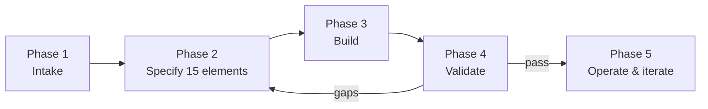
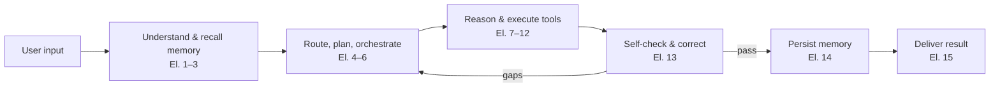
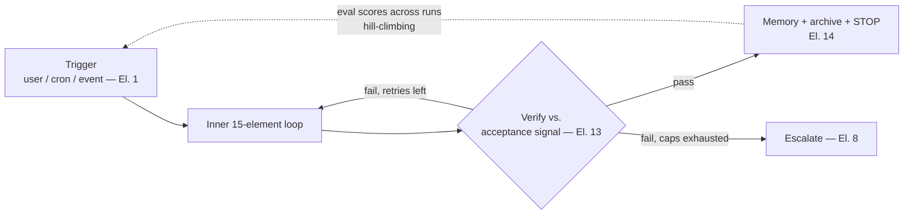

# AI Agent Development Guideline (Template 02)

> The step-by-step process for establishing an AI agent using this template pack.
> **Inputs:** the agent's responsibilities, objective, and architecture design structure.
> **Output:** a specified, built, validated agent.

---

## The five phases

---

## Phase 1 — Intake (capture the three inputs)

1. Copy [00-intake-form.md](00-intake-form.md) into your agent's folder (e.g. `agents/<agent-name>/intake-form.md`).
2. Fill sections **B (Objective)**, **C (Responsibilities)**, **D (Architecture structure)** first — these are the three driving inputs. Then complete E–G.
3. Pick the **complexity tier** in section D. When unsure, start one tier lower — upgrading later is cheap; an over-engineered agent is not.

**Gate:** objective stated in ≤2 sentences, ≥1 measurable success criterion, every responsibility has a trigger and an expected output.

## Phase 2 — Specify the 15 elements

1. Copy [01-agent-spec-template.md](01-agent-spec-template.md) next to your intake form.
2. Fill it **in this order** (dependency order, not numeric order):

   | Step | Elements | Why this order |
   |------|----------|----------------|
   | 2.1 | **1 Input · 15 Output** | Fix the two ends of the pipe first — what comes in, what goes out |
   | 2.2 | **5 Planner · 13 Reflection** | Turn the objective into a plan skeleton and its acceptance checks (mirror images of each other) |
   | 2.3 | **11 Tools · 9 Skills · 10 MCP** | Derive the capability stack from the responsibilities |
   | 2.4 | **2 Context · 7 Reasoning · 12 Observation** | Define the execution loop around the capabilities |
   | 2.5 | **4 Router · 6 Workflow · 8 Brain Hub** | Structure elements — only for your tier (see matrix below) |
   | 2.6 | **3 Memory Retrieval · 14 Memory Update** | Learning layer, once the run itself is defined |

3. Skip nothing silently: elements outside your tier get an explicit *"N/A because…"*.

**Gate:** the spec's sign-off table is fully checked.

### Element applicability matrix

| # | Element | Lite (single-purpose) | Standard (tool-using) | Full (multi-agent) |
|---|---------|:---------------------:|:---------------------:|:------------------:|
| 1 | Task Input | **Required** | **Required** | **Required** |
| 2 | Context Builder | **Required** | **Required** | **Required** |
| 3 | Memory Retrieval | Optional | **Required** | **Required** |
| 4 | Task Router | N/A | If >1 task type | **Required** |
| 5 | Task Planner | **Required** | **Required** | **Required** |
| 6 | Workflow Orchestration | N/A (linear) | Optional | **Required** |
| 7 | Reasoning & Decision | **Required** | **Required** | **Required** |
| 8 | Agent Brain Hub | N/A | Self (state it) | **Required** |
| 9 | Skills Layer | Optional | **Required** | **Required** |
| 10 | MCP Protocol | If external tools | **Required** | **Required** |
| 11 | Tools Layer | **Required** | **Required** | **Required** |
| 12 | Observation Feedback | **Required** | **Required** | **Required** |
| 13 | Reflection & Optimization | Light self-check | **Required** | **Required** |
| 14 | Memory Update | N/A | **Required** | **Required** |
| 15 | Output Generation | **Required** | **Required** | **Required** |

Lite ≈ 7 required elements · Standard ≈ 13 · Full = all 15.

### Loop layer applicability

The four loop layers ([loop-engineering-reference.md](../reference/loop-engineering-reference.md) §3) activate by tier and by intake answers, not all at once:

| Loop layer | Lite | Standard | Full | Activated by |
|------------|:----:|:--------:|:----:|--------------|
| 1 Agent loop (El. 7+12) | **Native** | **Native** | **Native** | always |
| 2 Verification loop (El. 13) | Light self-check | **Required** | **Required** | always |
| 3 Event-driven loop (El. 1+6) | If declared | If declared | If declared | a `scheduled`/`event` trigger in Intake C |
| 4 Hill-climbing loop (El. 13 eval set) | N/A | Optional | **Required** | Intake G eval cadence ≠ never |

## Phase 3 — Build

1. **Claude Code target:** follow [03-claude-code-mapping.md](03-claude-code-mapping.md) — it maps every spec element to a concrete file (`.claude/agents/*.md`, `CLAUDE.md`, `.mcp.json`, skills, memory directory). Or run the `/agent-builder` skill to generate these from your completed spec.
2. **Other frameworks:** the spec maps cleanly — system prompt (El. 2), tool definitions (El. 9–11), agent loop settings (El. 7, 12), planner/orchestrator config (El. 5, 6, 8), memory store (El. 3, 14), output formatter + guards (El. 15).
3. Build in the same dependency order as Phase 2: ends of the pipe → plan/checks → capabilities → loop → structure → memory.

**Gate:** the agent runs end-to-end on the typical input example from Intake E.

## Phase 4 — Validate

1. Copy [04-validation-checklist.md](04-validation-checklist.md) and score every element.
2. Run the agent on **3 representative tasks**: the typical case (Intake E), an edge case, and an out-of-scope request (it should decline or route to fallback, per Elements 1 and 4).
3. Verify each success criterion from Intake B against real output — this is the agent's own Element 13 applied from the outside.
4. **Seed the eval set** (if Intake G eval cadence ≠ never): the 3 scenario checks become eval cases #1–3 in the checklist's eval table; add cases from the success criteria to reach 5–8; record the first full run's scores as the **baseline**.
5. Any **fail** on a required element → back to Phase 2 for that element (the closed loop: discover gap → re-plan → re-execute).

**Gate:** validation checklist passes at your tier's threshold.

## Phase 5 — Operate & iterate (the loop phase)

This phase runs the outer loops of [loop-engineering-reference.md](../reference/loop-engineering-reference.md):

- **Arm the trigger** (event-driven loop): if Intake C declared a scheduled/event trigger, set it up per the loop construct map in [03-claude-code-mapping.md](03-claude-code-mapping.md) (`/schedule`, `/loop`, hooks). On-demand agents skip this.
- **Hill-climb** (if eval cadence ≠ never): re-run the eval set at the cadence from Intake G, add a score column, compare to the previous run. Any case that regresses (pass → fail) → Phase 2 for the owning element, even if totals still pass.
- **Guardrail review**: check run logs for stop-condition hits and near-runaway loops (budget almost exhausted). A frequently-hit stop condition is a spec gap — either the budget is too tight or the loop is wandering.
- Watch the run logs (Element 12) for recurring failures — each one is a spec gap, not just a bug.
- Let memory accumulate (Element 14), and prune it per Element 14's prune rule: stale memories mislead future runs.
- When responsibilities grow, return to the intake form first — new duties enter through section C, then flow to Router/Skills/Tools. Don't patch tools directly; the spec stops being the truth the moment you do.
- Re-run Phase 4 after any element change.

---

## The closed loop you are building

Every agent built from this pack should exhibit the PDF's core loop at runtime:

If a stage has no corresponding spec section, the agent will improvise there — and improvisation is where agents fail.

### The outer loops around it

Loop Engineering wraps that inner run in outer rings — what starts it, what proves it done, what stops it, what improves the next one:

Details: [loop-engineering-reference.md](../reference/loop-engineering-reference.md).
